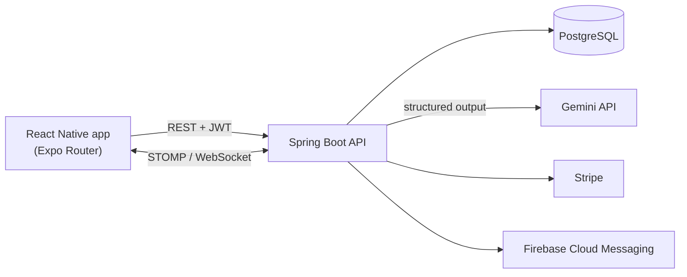

# Savvio

A mobile personal finance app with an AI assistant that **builds its own interface** — instead of replying with a wall of text, the model composes each answer from a fixed set of UI blocks: charts, budget cards, transaction summaries.

Built solo as an engineering thesis project at Lodz University of Technology: React Native (Expo) app + [Java Spring Boot backend](https://github.com/igorgardzielewski/savvio-backend).

---

## What it does

- **AI assistant with a generative interface** — ask *"how much did I spend on food this month?"* and get a pie chart, not a paragraph.
- **Receipt scanning** — photograph a receipt and the app extracts every line item (name, quantity, unit price, total) and turns it into expenses.
- **Shared family budget** — several people track one budget, with changes propagated live over WebSocket.
- **Budgets and goals** — spending categories with limits, savings goals with progress tracking.
- **Subscription tracking** — recurring payments with upcoming renewal dates.
- **Period reports** — summaries, category breakdowns, top expenses, budget vs. reality.
- **Premium subscription** — payments handled through Stripe.

---

## Architecture



The mobile app holds no business logic beyond presentation — aggregations, AI orchestration and access control all live in the backend.

---

## Generative UI — how it works

The interesting part of this project. The assistant does not return prose that the app then tries to parse. The backend hands Gemini a **JSON schema** it is required to satisfy (`responseSchema` + `responseMimeType: application/json`), where the `type` field is an enum of exactly the blocks the app knows how to render:

```json
{
  "blocks": [
    { "type": "text", "data": { "content": "You spent 2 400 zł this month, 12% more than in October." } },
    { "type": "pie_chart", "data": { "title": "By category",
        "items": [{ "label": "Food", "value": 900, "color": "#f87171" }] } },
    { "type": "budget_category", "data": { "title": "Overspent", "categoryIds": [5, 8] } }
  ]
}
```

The app walks the array and renders each block through `BlockRenderer`. An unknown `type` degrades to an error block rather than breaking the conversation.

| Block | Purpose |
|---|---|
| `text` | conversational reply — every response starts with one |
| `column_chart` | spending per day or per month |
| `pie_chart` | distribution across categories |
| `trend_chart` | change over time |
| `report_card` | summary metrics with up/down trends |
| `payment_summary` | list of specific transactions |
| `budget_category` | specific budget categories |
| `subscription_card` | upcoming subscription renewals |

Two design decisions worth naming:

**The model computes chart values, the app never does.** Aggregations arrive ready to plot, so chart components stay dumb and identical no matter which question produced them.

**Reference blocks carry database IDs, not data.** For transactions, categories and subscriptions the model returns `transactionIds: [101, 102]` and the app fetches the records itself. The model never restates amounts or merchant names, so it cannot silently distort them, and the payload stays small.

---

## Receipt scanning

A photo goes to the backend, which asks the model for a strictly typed structure — shop name, date, and a list of positions with unit, quantity, unit price and row total. The response also carries a `status` field, so a blurry or non-receipt photo comes back as a clean failure instead of invented numbers.

---

## Tech stack

**Mobile** — React Native 0.81, Expo 54, Expo Router, TypeScript, Zustand, NativeWind (Tailwind), Reanimated + Moti, react-native-gifted-charts, STOMP over SockJS

**Backend** — Java, Spring Boot, PostgreSQL + JPA, Spring Security with JWT and OAuth2 (Google sign-in), WebSocket, Caffeine cache, request rate limiting, scheduled jobs, OpenAPI/Swagger, Stripe, Firebase Admin, Google GenAI SDK

---

## Project structure

```
app/            screens (Expo Router file-based routing)
  (tabs)/         home, budget, subscriptions, explore
  (aiassistant)/  AI chat and its onboarding
  (addexpense)/   manual entry and receipt scanning
  (budget)/       budget details
  (goals)/        savings goals
  (family)/       shared family budget
  (report)/       period reports
  (profile)/      profile and settings
  (auth)/         sign in / sign up
components/
  ai_components/  UI blocks the model can compose + BlockRenderer
  report/         report sections
  budget/         budget widgets
store/          Zustand stores (auth, user)
helpers/        API clients and domain logic
hooks/          incl. useFamilyWebSocket
```

---

## Running locally

```bash
npm install
npx expo start
```

Create a `.env` file pointing at a running backend:

```
EXPO_PUBLIC_API_URL=http://localhost:8080
```

The app needs the backend for authentication, AI features and data. Native modules (camera, Google sign-in, push) require a development build — Expo Go is not enough.

---

## Status

Feature-complete as a thesis project and defended; not published to the App Store or Google Play. The backend lives in [igorgardzielewski/savvio-backend](https://github.com/igorgardzielewski/savvio-backend).

An email-parsing feature — pulling purchase confirmations straight from a mailbox — was prototyped against the Gmail API and dropped: extraction quality on real messages was too unreliable to trust with someone's finances, and there was not enough labelled data to fine-tune a model. Receipt scanning from a photo turned out to be both more accurate and closer to how people actually record expenses.
